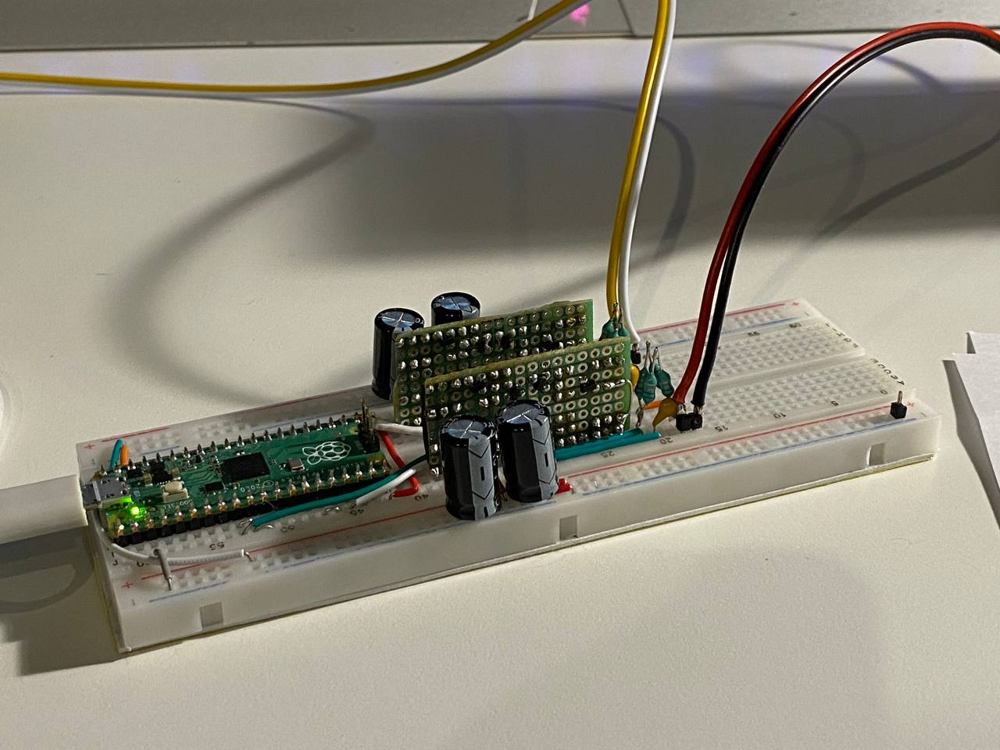

# RP2040 DAC-Amp

You can do PDM audio output using the PIO, 
but what if you can make a whole USB DAC & 5* watt per channel D-Class amplifier out of your Raspberry Pi Pico and some transistors?..

## Basic concept

In theory RP2040 is capable of acting as a USB audio device (tinyUSB), a PCM-to-PDM converter (with fixed point arithmetic) with 48KHz*32=1.536MHz sampling and a decent H-bridge driver (using PIO) at the same time, 
requiring only 6 MOSFETs per channel with some resistors and a low-pass output filter to make a complete... uhm... music device (no speakers included)

## Limitations

* With 12 MHz main oscillator it is better to avoid 44.1KHz and stick to 48Khz
* Each GPIO is rated for 12mA, however you can parallel 2 or 4 together
* RP2040 has no FPU and even integer division is not very fast, however it is hardware-accelerated
* You still need low gate charge 3.3V or even 1.8V gate voltage transistors

## Current state

* Built on a breadboard with H-bridges soldered on pieces of a stripboard
* With the help from Richard Schreier's delta-sigma toolbox (available in [matlab](https://www.mathworks.com/matlabcentral/fileexchange/19-delta-sigma-toolbox) and [python](https://python-deltasigma.readthedocs.io/))
  DSM was rewritten as a proper 4th order CIFF topology modulator
* Using only int32 add, multiply and shift with power-of-two coefficients (proper division is unacceptably slow),
  both the theoretical (delta-sigma toolbox) and real (building as dll) DSM SNR is at least 75 db in the passband
* However in real hardware at low volume it sounds terrible - rattling, screeching, bubbling - reminds of the sound of incoming GSM call near cheap speakers
* *- due to the nature of higher-order DSMs, to avoid the overload the input has to be limited to ~70% (value is experimental)
  so it is more like +-3.5V, so like with any cheap speakers the advertised power is a bit exaggerated... for a full amplitude "0%" THD sine wave the estimation is 1.5 watts per channel with 4 ohm load
* Now in stereo!
* Still haven't implemented volume and mute
* Supports 16 and 24 bitdepths at 48 KHz, 96 KHz is in progress. Higher is not possible due to full-speed USB limits

## Conclusions

It was interesting to understand how modern digital-to-analog sound conversion is made, but although general concepts are mostly the same, 
even the cheapest modern DAC is much, much more advanced than a software no-FPU-MCU solution ever could be, 
starting from oversampling which should be at least 64x, certainly more than 1-bit quantization (up to 6 bits according to wiki), enermous gate currents if you want some amplification too etc.

But to my surprise the sound is absolutely tolerable if you crank the volume above the screeching noise floor, 
and it is cute and smells of rosin when heated!

## What can and can not be improved

* I don't believe it is possible to do 64x oversampling instead of 32x for two channels due to both computational performance and transistor switching time.
  Not without a proper gate driver IC, but going this path it's easier to buy a real amplifier
* Multibit quantizer - 1.5 bits with +1, 0, -1 states - should be possible and in theory should greatly improve low volume performance
* Non-linear interpolation may improve the sound a bit
* Non-breadboard variant can definitely be an improvement
* Also i'm not sure my inductor assembly does its job and whether it affects the sound

